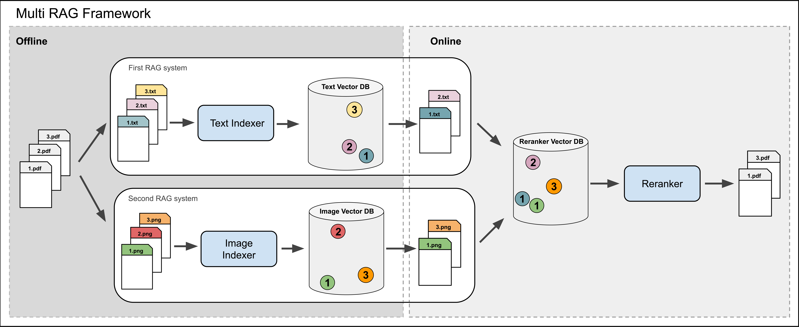
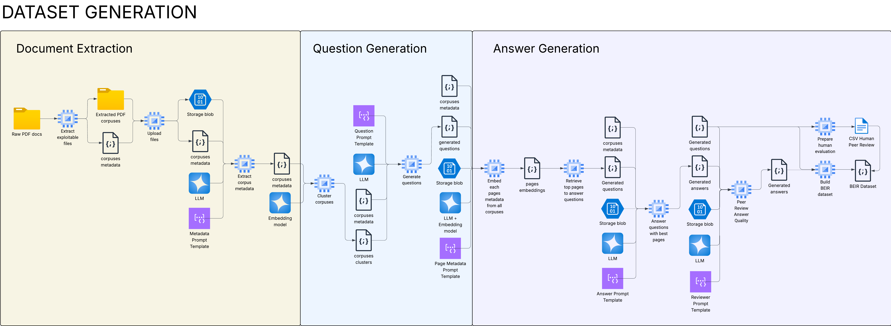

<div align="center">

# 🧠 Multi-RAG Optimization Platform

Imperial College London – Computing MSc Individual Project

[](./LICENSE)
[](https://www.python.org/)
[](https://fastapi.tiangolo.com/)
[](https://vuejs.org/)
[](https://github.com/astral-sh/uv)

<sub>Retrieval-Augmented Generation experimentation across Traditional, Multimodal & Composite (Multi) RAG strategies.</sub>

</div>

---

## 📌 Table of Contents

1. [Vision](#-vision)
2. [Core Features](#-core-features-in-development)
3. [Architecture](#-architecture-in-development)
4. [Diagrams](#-diagrams)
5. [Tech Stack](#-tech-stack)
6. [Quick Start](#-quick-start)
7. [Backend (RAG API)](#-backend-rag-api)
8. [Frontend (Evaluation UI)](#-frontend-evaluation-ui)
9. [Data & Indexing Workflow](#-data--indexing-workflow)
10. [API Reference](#-api-reference)
12. [Extending Pipelines](#-extending-pipelines)
13. [Project Structure](#-project-structure)
14. [Environment Variables](#-environment-variables)
16. [Roadmap](#-roadmap)
18. [Contributing](#-contributing)
19. [License](#-license)

---

## 🎯 Vision

Provide a unified playground to: build, load, index, retrieve and evaluate multiple Retrieval-Augmented Generation strategies (text only, multimodal & composite multi-RAG) with consistent APIs, reproducible evaluation, and modular configuration.

---

## 🚀 Core Features in Development

- **Pluggable RAG Types**: `TraditionalRAG`, `MultiModalRAG`, `MultiRAG` managed through a runtime loader.
- **Single Active Instance**: Ensures controlled GPU / memory footprint; hot-swap via `/rag/select`.
- **Async Document Indexing**: Task-tracked indexing with WebSocket progress streaming.
- **Flexible Ingestion**: Folder recursion & per-file ingestion (PDF, TXT, Markdown, Images: PNG/JPG/JPEG).
- **Retrieval & Answer Generation**: Unified endpoints (`/retrieve`, `/answer`).
- **Dynamic Config Cloning**: Automatic knowledge-base scoping without manual JSON duplication.
- **Evaluation Friendly**: Metrics artifacts (e.g. NDCG plots, clustering visuals) under `scripts/`.
- **Multi-Backend Embeddings / Models**: HuggingFace, OpenAI, Google (config driven) – ready for extension.
- **Frontend UI**: Vue 3 dashboard for exploring evaluation outputs & interacting with the system.
- **Reproducible Environments**: Python pinned via `pyproject.toml` + `uv.lock`; Node pinned via `package.json`.

---

## 🏗 Architecture in Development

```
┌─────────────────────────┐        ┌────────────────────────┐
│        Frontend         │  REST  │        FastAPI          │
│  (Vue / Vite dashboard) │◀──────▶│    RAG Orchestration    │
└──────────┬──────────────┘  WS    └──────────┬─────────────┘
					 │    (progress)                  │
					 ▼                                 ▼
	 Metrics / Plots                    Active RAG Instance
					 │                     (Traditional | Multimodal | Multi)
					 ▼                                 │
		 Evaluation UX                           │
					 │                                 ▼
					 └──────────────► Vector Stores / Embeddings / Models
```

---

## 🖼 Diagrams

| Flow                 | Image                                                    |
| -------------------- | -------------------------------------------------------- |
| Multi-RAG High-Level |           |
| Dataset Generation   |  |

---

## 🧰 Tech Stack

**Backend**: FastAPI, Uvicorn, Torch, Transformers, Sentence-Transformers, FlagEmbedding, OCR (PyMuPDF, pytesseract), `uv` package manager.

**Frontend**: Vue 3 + Vite, Pinia, D3 (viz), KaTeX (rendering).

**Evaluation & Analytics**: `ir-measures`, `pytrec-eval`, clustering & embedding visualization (`matplotlib`, `seaborn`).

---

## ⚡ Quick Start

### 1. Clone

```bash
git clone https://github.com/thomas-um-grant/ms-project.git
cd ms-project
```

### 2. Backend Setup (Python 3.12.11)

Install the ultra-fast `uv` if missing:

```bash
curl -LsSf https://astral.sh/uv/install.sh | sh
```

Sync environment:

```bash
cd backend
uv sync
```

Run development server (hot reload):

```bash
uv run python -m src.main --reload --host 0.0.0.0 --port 8000
```

Open interactive docs: http://localhost:8000/docs

### 3. Frontend Setup

```bash
cd frontend
npm install
npm run dev
```

Visit: http://localhost:5173 (default Vite port)

---

## 🐍 Backend (RAG API)

Entrypoint: `backend/src/main.py` → launches FastAPI app defined in `backend/src/app.py`.

Key concepts:

- `RAGManager`: Manages exactly one in-memory RAG instance.
- Config JSON: Lives in `backend/src/configs/` (add your own). Filename determines type heuristics (`traditional_`, `multimodal_`).
- Knowledge Base (KB): Logical dataset / index namespace.
- Dynamic cloning: When indexing a new folder, config is duplicated & name suffixed with KB for isolation.

### Launch Variants

| Mode         | Command                                                           |
| ------------ | ----------------------------------------------------------------- |
| Dev (reload) | `uv run python -m src.main --reload`                              |
| Prod (basic) | `uv run uvicorn src.app:app --host 0.0.0.0 --port 8000`           |
| Preload RAG  | `DEFAULT_RAG_CONFIG=traditional_x.json uv run python -m src.main` |

---

## 💻 Frontend (Evaluation UI)

- Vue 3 single-page app.
- Reads metrics artifacts from `public/metrics.json`.
- Extend components under `frontend/src/components/` & domain logic in `stores/`, `services/`.

Build for production:

```bash
cd frontend
npm run build
npm run preview
```

---

## 📂 Data & Indexing Workflow

1. Place raw documents (PDF / TXT / MD / images) in a folder accessible to the backend host.
2. Call `/index` with either a `folder_path` OR a list of `documents`.
3. Indexing runs asynchronously; progress accessible via REST polling or WebSocket.
4. Once complete, retrieval & answer endpoints operate over the active (config, KB).
5. Switching RAGs: call `/rag/select` with another config + KB.

Supported suffixes (by default): `pdf, txt, md, png, jpg, jpeg` (extend in code: `SUPPORTED_SUFFIXES`).

---

## 🔌 API Reference

### Health

```bash
curl -s localhost:8000/health | jq
```

### Load / Switch Active RAG

```bash
curl -X POST localhost:8000/rag/select \
	-H 'Content-Type: application/json' \
	-d '{"config": "traditional_example.json", "knowledge_base": "arxiv"}'
```

### Index (Async Task)

```bash
curl -X POST localhost:8000/index \
	-H 'Content-Type: application/json' \
	-d '{
				"config": "traditional_example.json",
				"knowledge_base": "demo",
				"folder_path": "/absolute/path/to/docs",
				"set_current": true
			}'
```

### Track Progress

```bash
curl localhost:8000/index/status/<task_id>
```

WebSocket (e.g. `wscat`):

```bash
wscat -c ws://localhost:8000/index/ws/<task_id>
```

### Retrieve

```bash
curl -X POST localhost:8000/retrieve \
	-H 'Content-Type: application/json' \
	-d '{"query": "What is contrastive learning?", "top_k": 5}' | jq
```

### Answer (Retrieve + Generate)

```bash
curl -X POST localhost:8000/answer \
	-H 'Content-Type: application/json' \
	-d '{"query": "Summarise retrieval augmented generation pipelines", "top_k": 5}' | jq
```

---

## 🧩 Extending Pipelines

Add a new RAG variant:

1. Implement class under `backend/src/pipeline/rags/`.
2. Expose uniform async interface: `extract(paths)`, `index()`, `retrieve(query, top_k)`, `answer(query, top_k)`.
3. Create config JSON (naming convention: `<type>_<label>.json`).
4. Load via `/rag/select` or trigger implicitly during indexing.

Model / Embedding additions: integrate inside config `configs` section; keep provider abstraction minimal.

---

## 🗂 Project Structure

```
backend/
	src/
		app.py          # FastAPI endpoints & task orchestration
		main.py         # Entrypoint (dev/prod launcher)
		pipeline/rags/  # RAG implementations (traditional / multimodal / multi)
		configs/        # JSON configs (add more in here)
frontend/
	src/              # Vue components, stores, services
scripts/            # Metrics, evaluation utils & plots
diagrams/           # Current architecture diagrams
archive/            # Historical notes & extra diagrams
```

---

## 🔐 Environment Variables

Create a `.env` in `backend/`.

```
GOOGLE_API_KEY=<GEMINI_API_KEY>
DEFAULT_RAG_CONFIG=traditional_arxiv.json
```

---

### Testing in Developement

- Add unit tests under `backend/tests/`.
- Frontend: `npm run test:unit` (Vitest).

---

## 🗺 Roadmap

- [ ] Unified evaluation runner script
- [ ] Add Docker + Compose stack
- [ ] Frontend interaction with live API (currently focused on static metrics)
- [ ] Streaming answer tokens endpoint
- [ ] Caching layer for repeated queries
- [ ] Structured output generation (JSON mode)

---

## 🤝 Contributing

1. Fork & create feature branch.
2. Keep PRs atomic (one concern each).
3. Include diagrams / metrics updates when altering pipeline logic.
4. Update this README if adding new subsystem.

---

## 📚 Citation

```bibtex
@misc{grant2025multirag,
	title  = {Multi-RAG Optimization Platform},
	author = {Grant, Thomas},
	year   = {2025},
	note   = {Imperial College London MSc Individual Project},
	url    = {https://github.com/thomas-um-grant/ms-project}
}
```

---

## 📄 License

Distributed under a Non-Commercial Apache 2.0 style license – see [`LICENSE`](./LICENSE).

---
