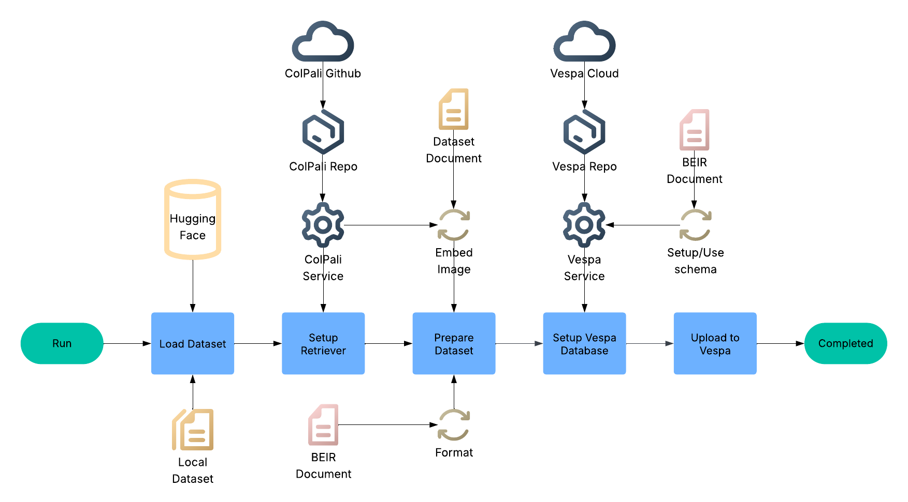
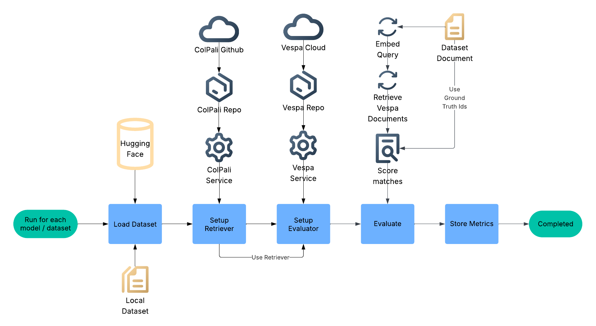

# RAG Evaluation pipeline

## Setup

### Dependencies

- HuggingFace account to download ViDoRe datasets and ColPali models
  - vidore-benchmark[colpali-engine] ([ViDoRe project](https://github.com/illuin-tech/vidore-benchmark))
  - datasets ([Huggingface](https://huggingface.co/docs/datasets/en/installation))

### Run locally

- Load a BEIR Formatted Dataset (from _digital_brain_be_):
  `python3 evaluation/load_eval_dataset.py --tenant-name "dev" --instance-name "default" --vespa-app-name "dbevals" --model-name "vidore/colqwen2-v1.0" --dataset-name "vidore/tabfquad_test_subsampled_beir"`

- Evaluate a model on a dataset (from _digital_brain_be_):
  `python3 evaluation/evaluate.py --model-names "vidore/colqwen2-v1.0" --dataset-names "vidore/tabfquad_test_subsampled_beir" --metrics-output-path "evaluation/results/metrics.json"`

- Generate a dataset from pdf documents (from _digital_brain_be_)
  `uv run evaluation/dataset/domain_specific_generation/pipeline.py --data_folder_path="evaluation/dataset/data"`

## Overview Diagrams

### Load Evaluation Dataset

### Evaluate

## Metrics

### Ranking Metrics by Cutoff (at K)

All the \_at_k metrics evaluate how well the system ranks relevant items in the top-k results.

- ndcg_at_k (Normalized Discounted Cumulative Gain):
  - Measures the ranking quality by considering the position of relevant items, giving higher scores when relevant items appear earlier in the list. Higher values indicate better performance.
- map_at_k (Mean Average Precision):
  - Calculates the average precision across all queries, focusing on the top-k positions. It is sensitive to the ranking of relevant items, rewarding systems that retrieve relevant items earlier.
- recall_at_k (Recall):
  - Represents the fraction of relevant items retrieved among all relevant items for a query. It assesses the system's ability to retrieve all relevant items within the top-k results.
- precision_at_k (Precision):
  - Indicates the fraction of retrieved items in the top-k results that are relevant. It measures the accuracy of the top-k retrieved items.
- mrr_at_k (Mean Reciprocal Rank):
  - Calculates the average reciprocal rank of the first relevant item across all queries. Higher MRR values suggest that relevant items are ranked higher in the result list.

### NAUCS Metrics (Normalized Area Under Curve Summary)

These are variations of AUC (Area Under Curve) stats.

- naucs_at_k_max:
  - Best normalized AUC score observed for the top-k ranked results (peak performance).
- naucs_at_k_std:
  - Standard deviation of nAUC scores across multiple runs or folds — measures stability (stability).
- naucs_at_k_diff1:
  - Difference from 1.0 (perfect nAUC), so it indicates how close performance is to the oracle (room for improvement).
